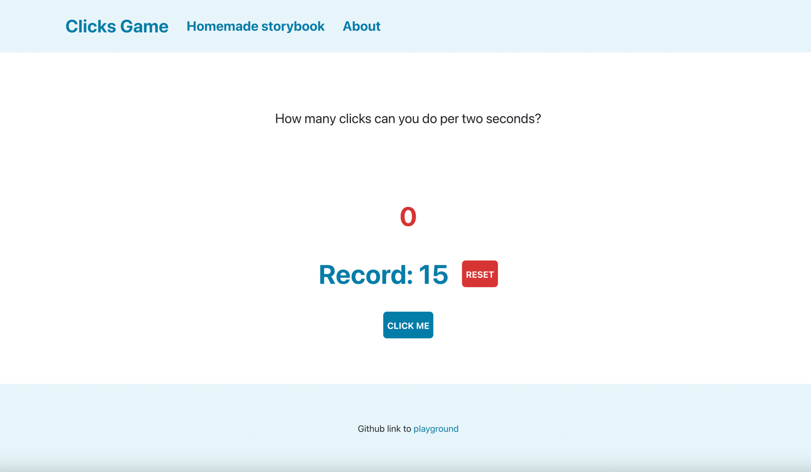

# Playground project

## Goal

The goal for the project is to demonstrate a piece of code based on a simple idea. To have some meaning behind let’s
take a look at a quite common situation when a company uses some third party library and wants to customise it.

To show how to handle this situation the project has a Button component. It uses Bootstrap button, but customised with
special styles.

Of course, if company does not have any plans to change `Bootstrap` to anything else or is not interested in creating
its
own components library, then dev team has to use `Bootstrap` customisation approach with special
classes/variables/etc.
Anyway, it is not the goal of this project, so let’s imagine that the company wants to get rid of Bootstrap step by step
to create their own specific design.

## Clicks Game

The project contains just one page with a simple game. The goal in the game is to click a button as many times as
possible in 2 seconds. Counts all the clicks per last two seconds.

Example, \
`1st second`: **4** clicks -> Current amount is **4** clicks \
`2d second`: **3** clicks -> Current amount is **7** clicks \
`3d second`: **2** clicks -> Current amount is **5** clicks, because 1st second clicks are expired \
`Record` is **7** clicks, because record is only updated when the user have a bigger current amount than before

P.S: My record is 19, what’s yours?

# Screenshots
## Clicks Game (desktop)


# React + TypeScript + Vite

This template provides a minimal setup to get React working in Vite with HMR and some ESLint rules.

Currently, two official plugins are available:

- [@vitejs/plugin-react](https://github.com/vitejs/vite-plugin-react/blob/main/packages/plugin-react/README.md) uses [Babel](https://babeljs.io/) for Fast Refresh
- [@vitejs/plugin-react-swc](https://github.com/vitejs/vite-plugin-react-swc) uses [SWC](https://swc.rs/) for Fast Refresh

## Expanding the ESLint configuration

If you are developing a production application, we recommend updating the configuration to enable type aware lint rules:

- Configure the top-level `parserOptions` property like this:

```js
export default {
  // other rules...
  parserOptions: {
    ecmaVersion: 'latest',
    sourceType: 'module',
    project: ['./tsconfig.json', './tsconfig.node.json'],
    tsconfigRootDir: __dirname,
  },
}
```

- Replace `plugin:@typescript-eslint/recommended` to `plugin:@typescript-eslint/recommended-type-checked` or `plugin:@typescript-eslint/strict-type-checked`
- Optionally add `plugin:@typescript-eslint/stylistic-type-checked`
- Install [eslint-plugin-react](https://github.com/jsx-eslint/eslint-plugin-react) and add `plugin:react/recommended` & `plugin:react/jsx-runtime` to the `extends` list
